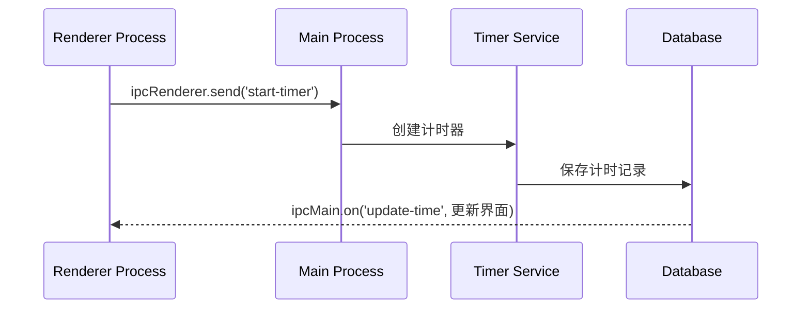

# 超级番茄钟开发指导书

## 一、项目结构设计
```
super-tomato/
├── electron/          # 主进程代码
├── src/               # 渲染进程代码
│   ├── common/        # 公共组件
│   ├── pomodoro/      # 番茄钟模块
│   ├── todo/          # Todo List模块
│   ├── countdown/     # 倒数日模块
│   └── services/      # 公共服务
├── assets/            # 静态资源
└── database/          # SQLite数据库文件
```

## 二、模块交互设计
### 1. 进程通信架构


### 2. 模块连接方式
#### (1) 主进程（Electron）
```javascript
// electron/main.js
const { ipcMain } = require('electron')

// 接收渲染进程事件
ipcMain.handle('timer-control', (event, action) => {
  return TimerService.handleAction(action)
})
```

#### (2) 番茄钟模块
```javascript
// src/pomodoro/TimerComponent.jsx
const startTimer = () => {
  window.electron.ipcRenderer.invoke('timer-control', {
    type: 'START',
    duration: 25*60 // 25分钟
  })
}
```

#### (3) 数据服务层
```javascript
// src/services/database.js
export const saveTodoItem = (item) => {
  return window.electron.ipcRenderer.invoke('db-query', {
    sql: 'INSERT INTO todos ...',
    params: [item.text, item.dueDate]
  })
}
```

## 三、核心模块实现指南

### 1. 番茄钟模块
```javascript
// 计时器核心逻辑
class Timer {
  constructor() {
    this.remaining = 0
    this.interval = null
  }
  
  start(duration) {
    this.remaining = duration
    this.interval = setInterval(() => {
      this.remaining--
      if(this.remaining <= 0) this.notify()
    }, 1000)
  }
}
```

### 2. Todo List模块
```javascript
// 任务状态管理
const TodoStore = {
  tasks: [],
  
  addTask(text) {
    this.tasks.push({
      id: Date.now(),
      text,
      completed: false
    })
  }
}
```

### 3. 数据存储设计
```sql
-- 数据库表结构
CREATE TABLE pomodoro_records (
  id INTEGER PRIMARY KEY,
  start_time DATETIME,
  duration INTEGER
);

CREATE TABLE todos (
  id INTEGER PRIMARY KEY,
  content TEXT,
  due_date DATETIME,
  is_completed BOOLEAN
);
```

## 四、模块连接实践

### 1. 跨模块通信模式
- 使用发布订阅模式实现模块解耦
```javascript
// src/common/eventBus.js
const listeners = {}

export default {
  on(event, callback) {
    if (!listeners[event]) listeners[event] = []
    listeners[event].push(callback)
  },
  
  emit(event, data) {
    (listeners[event] || []).forEach(fn => fn(data))
  }
}
```

### 2. 状态共享方案
```javascript
// src/common/GlobalState.jsx
import { createContext } from 'react'

export const AppContext = createContext()

// 在根组件使用
<AppContext.Provider value={{ settings, tasks }}>
  {children}
</AppContext.Provider>
```

## 五、开发运行流程
1. 安装依赖
```bash
npm install electron react react-dom sqlite3
```

2. 启动开发模式
```bash
npm run dev
```

3. 打包应用
```bash
npm run make
```

## 六、测试方案
1. 单元测试：对每个模块的核心功能编写测试用例
```javascript
test('番茄钟计时逻辑', () => {
  const timer = new Timer(1500) // 25分钟
  timer.start()
  setTimeout(() => {
    expect(timer.remaining).toBe(1490)
  }, 10000)
})
```

2. 集成测试：验证模块间协作
```javascript
test('完成todo自动记录番茄钟', async () => {
  await todoModule.completeTask(taskId)
  const records = await db.query('SELECT * FROM pomodoro_records')
  expect(records.length).toBe(1)
})
```

## 七、扩展性设计
### 1. 功能扩展接口
```javascript
// 扩展点示例：通知系统
class NotificationSystem {
  static registerPlugin(plugin) {
    this.plugins.push(plugin)
  }
  
  static notify(message) {
    this.plugins.forEach(p => p.send(message))
  }
}

// 扩展实现
NotificationSystem.registerPlugin({
  send: (msg) => { /* 自定义通知方式 */ }
})
```

### 2. 配置文件示例
```json
// config.json
{
  "features": {
    "pomodoro": true,
    "todo": true,
    "countdown": false
  }
}
```

## 八、常见问题解决方案
1. **Electron进程通信阻塞**
   - 使用`invoke/handle`代替`send/on`
   - 耗时操作放在主进程

2. **数据库并发访问冲突**
   ```javascript
   // 使用事务处理
   db.run('BEGIN TRANSACTION')
   // 执行操作
   db.run('COMMIT')
   ```

3. **React状态不同步**
   - 使用`useEffect`监听Electron事件
   ```javascript
   useEffect(() => {
     window.electron.ipcRenderer.on('time-update', setTime)
     return () => window.electron.ipcRenderer.removeListener('time-update')
   }, [])
   ```

## 九、推荐开发流程
1. 搭建基础框架（1天）
2. 实现核心通信机制（2天）
3. 并行开发各模块（10天）
4. 集成测试与调试（3天）
5. 打包与文档整理（2天）

---

本指导书配套资源：
1. [Git仓库模板](https://github.com/electron-react-boilerplate)
2. [数据库设计工具](https://sqlitebrowser.org/)
3. [UI设计稿Figma链接](https://figma.com/community/file/12345)

建议每个模块开发时：
1. 先定义接口文档
2. 使用Mock数据进行开发
3. 每日进行代码合并
4. 使用Postman测试API（如果需要）

遇到问题优先参考：
- Electron官方文档
- React Beta文档
- SQLite常见问题集